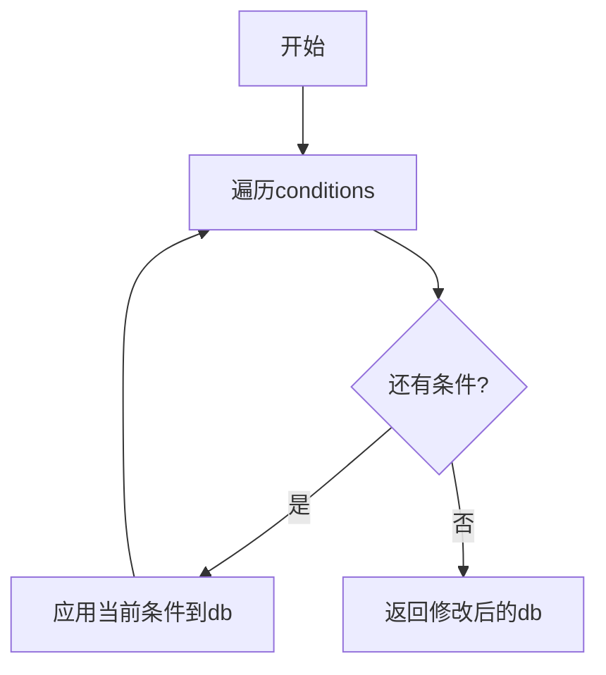

# 边缘网关部分代码相关

## $op\_log\_api$

### 整体结构分析

```tex
📦 sys_api
├── 📄 控制器层 (Controller)
├── 📦 依赖
│   ├── 📄 服务层 (Service)
│   ├── 📄 日志装饰器 (LogDecorator)
│   └── 📄 各种模型定义
└── 🌐 路由注册
```


### 控制器结构体

```go
// SysOpLogController 控制器层
type SysOpLogController struct {
    service      *sys_service.SysOpLogService  // 服务层实例
    logDecorator *sys_log.LogDecorator         // 日志装饰器
}
```

- **应用分层：**是一种软件开发设计思想，将应用程序划分成$N$个层次，每个层次都分别负责自己的职责，多个层次之间来协同提供完整的功能

- **$MVC$模型：**是一种思想，把软件系统分为以下三部分

  - $Model$（模型）：用来处理程序中数据逻辑的部分。

  - $View$（视图）：在应用程序中，专门和浏览器进行交互，展示数据的资源。

  - $Contreller$（控制器）：可以理解成一个分发器，来决定对于视图发来的请求，需要用哪一个模型来处理，以及处理完后需要跳回到哪一个视图，也就是用来连接视图和模型的。

  - 而现在主流的是前后端分离，不再需要$View$这个模块了，只需要约定好接口，写好后端即可，对于后端也有三层架构，分为以下三层：

  - $Controller$ 层：控制层，用来接收前端发来的请求，在$Service$ 层中选择对应的处理逻辑，并且给前端进行响应。

  - $Service$层：业务逻辑层，主要负责业务模块的逻辑应用设计对发来的请求进行具体的逻辑处理。

  - $DAO$层：数据访问层，负责访问数据库，进行增删改查的操作。

    

- **总结**

  - $DAO$面向表，$Service$面向业务。后端开发时先数据库设计出所有表，然后对每一张表设计出$DAO$层，然后根据具体的业务逻辑进一步封装$DAO$层成一个$Service$层，对外提供成一个服务。

  - 在具体的项目中，其流程为：$Controller$层调用$Service$层的方法，Service层调用$Dao$层中的方法，总的来说这样每层做什么的分类只是为了使业务逻辑更加清晰，写代码更加方便，它其实就是提供一种规则，把相同类型的代码放在一起，从而形成了层次，从而达到分层解耦、复用、便于测试和维护的目的。

#### $Go$泛型服务基类

- **基本结构**

```go
type BaseService[T any] struct {
    db *gorm.DB
}
```

- 这里的$[T\ \ any]$是泛型
- 参数声明，但不是函数参数。他表示这个结构体可以接收任意类型作为**类型参数**。
  - 类型参数：是泛型编程中的占位符，它表示在定义时不绑定具体类型，在使用时才指定实际类型。类型参数在编译期就会被确定，不影响运行时性能。定义时不绑定，使用时才确定。
  - 泛型主要应用于为不同类型代码编写完全相同的逻辑。
  - 在这相当于对结构体内做了个$any$的类型约束，之后就可以向结构体内传入任何类型的变量或者函数了。可以这样理解吗？
    - 更准确的说是定义了一个**类型参数化的结构体**，在**实例化时**才能确定具体类型。
- 实例化时类型是唯一的，在编译时固化,运行时在已经完全是具体类型时运行。性能和直接写具体类型几乎相同。没有反射或类型断言的开销。


### 构造函数

```go
// NewSysOpLogController 创建控制器实例
func NewSysOpLogController(
    service *sys_service.SysOpLogService, //依赖的服务层示例
    logDecorator *sys_log.LogDecorator,	//日志装饰器依赖
) *SysOpLogController {
    return &SysOpLogController{
        service:      service,      // 注入服务依赖
        logDecorator: logDecorator, // 注入日志工具
    }
}
```

用来**初始化**结构体实例，并返回该实例。构造函数可以封装复杂初始化逻辑。

实例化就是创建类型的实际对象（分配内存），实例化后才可以调用方法。

实例化并不等于方法初始化，实例化只是创建数据容器，方法是在**类型定义时绑定**的，实例化后自动获得使用该类型所有方法的能力。

所有依赖都必须在服务实例化时完成注入。创建依赖→注入依赖→配置路由

相当于是所有$API$需要的依赖都在$Service$层实现，然后在$API$初始化的时候注入，之后$API$才可以调用。

依赖注入容器是什么？


- **为什么需要$SysOpLogController$？**
  - **$MVC$中的$C$层：**作为系统入口，处理$HTTP$协议相关逻辑
  - **职责隔离：**只负责路由转发和参数校验，不包含业务逻辑
  - **统一管控：**集中管理日志相关的所有$API$断点。

**业务关系**

```tex
HTTP请求 → [Controller] → 调用 → [Service] → 处理业务 → 返回结果
```

- **为什么需要$SysOpLogService$？**
  - **业务逻辑容器：**处理具体的日志增删改查逻辑
  - **事务管理：**未来可扩展添加数据库事务控制
  - **复用性：**可被多个控制器调用（如后台管理+开放$API$）

**典型调用链**

```go
controller.GetByID() 
    → service.GetByID() 
        → repository.Find()  // 隐含的数据库操作
```

- **为什么需要$LogDecorator$？**
  - **$AOP$实践：**无侵入式访问记录接口访问日志
  - **元数据扩展：**携带$BusinessType$等附加信息
  - **统一拦截：**在业务逻辑前后自动插入日志记录

**执行流程**

```tex
请求进入 → [Decorate] 
    → 记录开始日志 
        → 执行实际Handler 
            → 记录结束日志
```


### 模块标识方法

```go
func (c *SysOpLogController) GetModule() string {
    return "日志API"  // 返回当前模块名称
}
```

- 用于日志分类或监控统计
- 无参数方法，返回固定值来表示模块标识。


### 路由注册

```go
func (c *SysOpLogController) RegisterRoutes(group *gin.RouterGroup) {
    logGroup := group.Group("/sys-op-log")  // 创建子路由组
    {
        logGroup.GET("/:id", 
            c.logDecorator.Decorate(          // 日志装饰器包装
                frame_model.LogMetadata{
                    BusinessType: frame_model.BusinessTypeUpdate,
                }, 
                c.GetByID,                    // 实际处理函数
            ))
        
        logGroup.GET("/list", c.List)        // 查询列表
        
        logGroup.DELETE("/:id", 
            c.logDecorator.Decorate(          // 同上装饰器
                frame_model.LogMetadata{//这个部分是元数据配置
                    BusinessType: frame_model.BusinessTypeUpdate,//这里是元数据
                },
                c.DeleteByID,
            ))
    }
}
```

- 使用$logDecorator.Decorate()$实现$AOP$（面向切面编程）

-	$Decorate$是装饰器，用于装饰器包装实际处理函数

- 元数据就是**描述数据的数据**

- 元数据如何使用
  ```go
  // 定义元数据结构
  type LogMetadata struct {
      BusinessType string // 业务类型
      Module       string // 模块名称
      Operator     string // 操作人
      TraceID      string // 请求追踪ID
  }
  
  // 在装饰器中注入
  func (c *Controller) updateUser(ctx *gin.Context) {
      meta := LogMetadata{
          BusinessType: "USER_UPDATE",
          Module:       "账号安全",
          Operator:     ctx.GetString("username"),
          TraceID:      ctx.GetString("X-Trace-ID"),
      }
      c.logDecorator.Decorate(meta, c.doUpdate)(ctx)
  }
  
  // 日志输出效果：
  // [USER_UPDATE][账号安全] 用户:admin 修改了密码 TraceID:abc123
  ```

- 


**路由图解**

```tex
GET    /sys-op-log/:id    → GetByID
GET    /sys-op-log/list   → List  
DELETE /sys-op-log/:id    → DeleteByID
```


**$Decorate$ 装饰器方法**

```go
// Decorate 方法，用于装饰路由处理函数
func (d *LogDecorator) Decorate(metadata frame_model.LogMetadata, handler gin.HandlerFunc) gin.HandlerFunc {
	return func(c *gin.Context) {
		startTime := time.Now()

		// 替换原始的 ResponseWriter，用于捕获响应数据
		responseWriter := &responseCaptureWriter{ResponseWriter: c.Writer, body: &bytes.Buffer{}}
		c.Writer = responseWriter
		// 获取请求参数和请求体数据
		var requestParams string
		var requestData string
		// 获取请求参数（提前捕获）
		if c.Request.Method == http.MethodGet {
			// GET 请求从查询参数中获取
			requestParams = c.Request.URL.RawQuery
		} else {
			// 非 GET 请求读取请求体
			bodyBytes, err := io.ReadAll(c.Request.Body)
			if err != nil {
				fmt.Printf("读取请求体失败: %v\n", err)
				requestData = "无法读取请求体"
			} else {
				requestData = string(bodyBytes)
			}
			// 读取完请求体后需要重新设置，否则后续处理无法读取请求体
			c.Request.Body = io.NopCloser(bytes.NewBuffer(bodyBytes))

			// 同时获取查询参数（POST、PUT 等也可能有查询参数）
			requestParams = c.Request.URL.RawQuery
		}

		// 执行业务逻辑
		handler(c)

		// 获取动态信息
		statusCode := c.Writer.Status()
		latency := time.Since(startTime)

		// 构造日志对象
		log := &sys_model.SysOpLog{
			Module:        metadata.Module,
			Operation:     string(metadata.BusinessType),
			RequestMethod: c.Request.Method,
			Status:        statusCode,
			IPAddress:     c.ClientIP(),
			OperationDate: frame_model.CustomTime(startTime),
			Latency:       latency.Milliseconds(),
			RequestURL:    c.Request.URL.Path,
			MethodName:    getSimpleHandlerName(c.HandlerName()),
			RequestData:   requestData,
			RequestParams: requestParams,
			ResponseData:  responseWriter.body.String(),
		}

		// 保存日志
		if d.logService != nil {
			err := d.logService.Create(log)
			if err != nil {
				fmt.Printf("日志存储失败: %v\n", err)
			}
		} else {
			fmt.Println("日志服务未初始化")
		}
	}
}
```

- 客户端首先请求，随后调用装饰器记录开始时间，捕获请求数据。随后调用原有业务逻辑并返回处理结果。最后收集响应数据，保存完整日志。并返回响应。

- 记录了谁在什么时候做了什么动作，记录请求和响应的完整数据，记录系统性能指标，集中存储便于后续分析。

- $c.Request.Method：$ 获取$HTTP$请求方法，返回$string$类型。

- $c.ClientIP()：$获取客户端真实$IP$

- $URL$信息获取：
  ```go
  c.Request.URL.Path      // 请求路径（如 "/api/user"）
  c.Request.URL.RawQuery  // 原始查询字符串（如 "name=foo&age=20"）
  ```

- $c.Request.X：$用来获取$Request$方法里的所需要的$X$字段。（如请求头 $c.Request.Header$）

- $io.ReadAll$：从$io.Reader$读取所有数据，直到$EOF$。返回读取到的所有数据和$err$错误

- $io.NopCloser：$ 将普通的$Reader$包装成$ReadCloser$（带空操作的$Close$方法）

  - 为什么要实现？  接口$Request.Body$需要这个类型。保持接口一致性但避免真实资源关闭。

- **请求体读取:**

  ```go
  //原始读取方式
  bodyBytes, err := io.ReadAll(c.Request.Body)
  
  //请求体重置
  c.Request.Body = io.NopCloser(bytes.NewBuffer(bodyBytes))
  ```

  - $ReadAll$会消耗$Reader$，必须重置。
  - 重置将读取的$body$数据重新放回，供后续处理使用。

  - 为什么读取会消耗$Reader$？被消耗的$Reader$是什么？
    - 读取操作会移动底层流指针的位置，因此就像被消耗了一样所以需要重置来使他回到原来的位置。
    - $c.Request.Body$是$io.ReadCloser$类型。

- 闭包是指一个函数于其相关的环境组合而成的实体
  ```go
  func (d *LogDecorator) Decorate(...) gin.HandlerFunc {
      return func(c *gin.Context) { // 这就是闭包
          // 可以访问外部变量：metadata, handler, d(LogDecorator实例)
      }
  }
  ```

- 以上装饰器的主要功能就是捕获$HTTP$请求数据（$URL$参数，请求体）、捕获$HTTP$响应数据（通过自定义$Writer$）、记录性能指标（如耗时等）最后将所有信息组合成日志对象存储。

- 此处需要替换$ResponseWriter$是因为原生的$Writer$有限制，默认的$ResponseWriter$写入数据后无法读取已写入的内容而这里需要记录响应内容供日志使用。

```go
type responseCaptureWriter struct {
	gin.ResponseWriter
	body *bytes.Buffer
}

func (w *responseCaptureWriter) Write(data []byte) (int, error) {
	// 将响应数据写入缓存
	w.body.Write(data)
	// 写入原始的 ResponseWriter
	return w.ResponseWriter.Write(data)
}
```

- Buffer是什么？

  - 是一种数据结构，用于临时存储数据，以便稍后进行处理。$bytes.Buffer$ 是一个预定义的类型，用于存储和操作字节序列。$bytes.Buffer$ 类型提供了很多有用的方法，例如：读写字节、字符串、整数和浮点数等。
    ```go
    // 创建一个空的缓冲区
    var buf bytes.Buffer
    // 向缓冲区写入字符串
    buf.WriteString("Hello, World!")
    // 从缓冲区读取字符串
    fmt.Println(buf.String()) // 输出：Hello, World!
    ```

  - 要使用$Buffer$类型，我们首先需要创建一个缓冲区。可以通过$NewBuffer$ 函数创建或$bytes.Buffer$ 结构体创建。

  - 如果要**写入数据**需要使用$Write$方法
    ```go
    func (b *Buffer) Write(p []byte) (n int, err error)
    ```

    其中，$p$ 参数是要写入缓冲区的字节切片，返回值 $n$ 表示实际写入的字节数，$err$ 表示写入过程中可能出现的错误

  - 如果要读取数据的话需要使用$Read$方法

    ```go
    func (b *Buffer) Read(p []byte) (n int, err error)
    ```

    其中，$p$ 参数是用于存放读取数据的字节切片，返回值 $n$ 表示实际读取的字节数，$err$ 表示读取过程中可能出现的错误。


### 具体业务方法

#### $GetByID$ — 根据$ID$查询

```go
func (c *SysOpLogController) GetByID(ctx *gin.Context) {
    // 1. 从URL获取id 并参数转换（字符串ID → 数字）
    id, err := strconv.Atoi(ctx.Param("id")) 
    if err != nil {  //错误处理
        web_model.ResponseError(ctx, http.StatusBadRequest, "无效的ID")
        return
    }
    
    // 2. 调用服务层方法
    log, err := c.service.GetByID(uint(id))
    if err != nil {  //服务层错误处理
        web_model.ResponseError(ctx, http.StatusInternalServerError, err.Error())
        return
    }
    
    // 3. 统一格式返回  成功响应
    web_model.ResponseSuccess(ctx, log)
}

```

**执行流程**

```tex
请求 → 参数校验 → 服务调用 → 统一响应
```

```go
func (s *BaseService[T]) GetByID(id uint) (*T, error) {
    var entity T
    if err := s.db.First(&entity, id).Error; err != nil {
       if errors.Is(err, gorm.ErrRecordNotFound) {
          return nil, errors.New("记录不存在")
       }
       return nil, err
    }
    return &entity, nil
}
```

- 使用指针可以修改接收者内部的状态

- 方法语法

```go
// 标准函数语法
func 函数名(参数列表) (返回值列表) {
    // 函数体
}

// 方法语法
func (接收者 接收者类型) 方法名(参数列表) (返回值列表) {
    // 方法体
}

func (c *SysOpLogController) GetByID(ctx *gin.Context) {
    // 方法实现
}
```

- 方法在调用时是`实例.方法名()`，而函数直接调用函数名就可以

- 函数只能访问传入的参数，方法可以访问接收者的字段和方法

- 用方法来对整个实例进行操作，使得在功能复杂的程序中可以有针对性的调用，更容易根据分类记忆

- 方法可以**将相关操作组织在一起**，天然拥有**上下文**，有着更好的**封装性**

- 但是必须通**过实例调用**，不能独立存在并且于特定的类型耦合

- 方法与函数体的本质区别在于**是否绑定到类型**
- 方法的接收者可以为泛型


#### $List$ — 分页查询

```go
func (c *SysOpLogController) List(ctx *gin.Context) {
    // 1. 绑定查询参数
    var searchBo sys_model.SysOpLogSearchBo
    if err := ctx.ShouldBindQuery(&searchBo); err != nil {
        web_model.ResponseError(ctx, http.StatusBadRequest, err.Error())
        return
    }
    
    // 2. 调用服务层
    result, err := c.service.List(searchBo)
    if err != nil {
        web_model.ResponseError(ctx, http.StatusInternalServerError, err.Error())
        return
    }
    
    // 3. 返回分页结果
    web_model.ResponseSuccess(ctx, result)
}
```

**查询参数处理**

自动将URL参数绑定到$searchBo$结构体（如$/list?page=2\&pageSize=20$）


```go
func (s *BaseService[T]) List(searchParams frame_model.SearchParams, conditions map[string]interface{}) (*frame_model.NexusPageResult, error) {

    searchParams.SetDefaults()//分页查询的默认条件

    var entities []T

    // 调用 NexusQueryPage 进行分页查询
    pageResult, err := frame_utils.NexusQueryPage[T](s.db, &entities, searchParams, conditions)
    if err != nil {
       return nil, err
    }

    return pageResult, nil
}
```


```go
// NexusQueryPage 使用 GORM 进行分页查询，并返回分页结果
func NexusQueryPage[T any](db *gorm.DB, model *[]T, searchParams frame_model.SearchParams, conditions map[string]interface{}) (*frame_model.NexusPageResult, error) {
	var total int64 = 0

	// 应用查询条件
	db = applyConditions(db, conditions)

	// 排序处理
	if searchParams.OrderByColumn != "" {
		orderDirection := "ASC"
		if !searchParams.IsAsc {
			orderDirection = "DESC"
		}
		db = db.Order(fmt.Sprintf("%s %s", searchParams.OrderByColumn, orderDirection))
	}

	// 查询总记录数
	if err := db.Model(new(T)).Where(conditions).Count(&total).Error; err != nil {
		return nil, err
	}

	// 计算偏移量
	offset := (searchParams.CurrentPage - 1) * searchParams.PageSize

	// 分页查询
	if err := db.Limit(searchParams.PageSize).Offset(offset).Find(model).Error; err != nil {
		return nil, err
	}

	// 计算总页数
	totalPages := int(math.Ceil(float64(total) / float64(searchParams.PageSize)))

	// 返回分页结果
	return &frame_model.NexusPageResult{
		Total:       total,
		CurrentPage: searchParams.CurrentPage,
		PageSize:    searchParams.PageSize,
		TotalPages:  totalPages,
		List:        *model, // 返回切片内容
	}, nil
}
```

- $Sprintf：$ 格式化字符串但不输出，而是返回结果字符串，不会$Printf$那样打印到标准输出


$GO$中的几种$for$循环

```go
//传统C风格循环
for 初始化; 条件; 后续操作 {
    // 循环体
}
//eg：
for i := 0; i < 5; i++ {
    fmt.Println(i) // 打印0-4
}
//while风格循环
for 条件 {
    // 循环体
}
//eg：
count := 0
for count < 5 {
    fmt.Println(count)
    count++
}
//针对集合的range循环
for key, value := range 集合 {
    // 循环体
}
//eg：比如在以下查询中要用到的
for key, value := range conditions {
    // key是字符串，value是interface{}
}
//每次迭代自动获取下一对简直，遍历顺序不固定
```


```go
// 输入：GORM查询对象 + 条件map
// 输出：应用了所有条件的查询对象
func applyConditions(db *gorm.DB, conditions map[string]interface{}) *gorm.DB {
    for key, value := range conditions {
       db = db.Where(key, value)  //相当于SQL中WHERE条件追加，并保持GORM的链式调用特性
    }
    return db
}
```




- 主要作用是**将$map$形式的查询条件动态应用到$GORM$查询上**，相当于一个条件构造器

- $db.Order():$为$SQL$查询添加$ORDER\ \ BY$子句，支持多字段排序，可以多次调用实现排序优先级
  ```go
  func (db *DB) Order(value interface{}) *DB
  // 单字段
  db.Order("created_at DESC")
  // 多字段
  db.Order("department ASC, salary DESC")
  ```

  


#### $DeleteByID$ — 逻辑删除

```go
func (c *SysOpLogController) DeleteByID(ctx *gin.Context) {
    // 1. ID转换
    id, err := strconv.Atoi(ctx.Param("id"))
    if err != nil {
        web_model.ResponseError(ctx, http.StatusBadRequest, "无效的ID")
        return
    }
    
    // 2. 调用服务层删除
    if err := c.service.DeleteByID(uint(id)); err != nil {
        web_model.ResponseError(ctx, http.StatusInternalServerError, err.Error())
        return
    }
    
    // 3. 返回空成功响应
    web_model.ResponseSuccessNoData(ctx)
}
```

- 是逻辑删除而不是物理删除

- $new(T)：$ 创建模型类型的零值实例，用于$GORM$识别要操作的表。


#### 错误处理规范

```go
// ResponseError 用于发送错误响应
func ResponseError(c *gin.Context, code int, message string) {
	// 构建响应体
	response := ApiResponse{
		Code:    code,
		Message: message,
		Result:  false,
	}
	// 发送JSON响应
	c.JSON(code, response)
}

func ResponseSuccess(c *gin.Context, data interface{}) {
	c.JSON(http.StatusOK, ApiResponse{
		Code:    http.StatusOK,
		Message: "成功",
		Result:  true,
		Data:    data,
	})
}
```


- $gorm.DB$中的$Create()$​

```go
func (db *DB) Create(value interface{}) *DB
// 创建单条记录
result := db.Create(&user)
// 批量创建
result := db.Create(&users) // users是切片
```

用来将结构体数据插入数据库，处理关联数据的创建，还有钩子触发的相关部分。

**钩子（$HOOK$）**

钩子就像事件监听器，是在数据库操作过程中自动触发的回调函数。

回调函数可以将一个函数$A$传递给$B$，让$B$在执行结束后调用$A$。


## $login\_api$

完成用户登录功能，并在登陆时使用装饰器获取日志所需信息并生成日志。

### 装饰器模式

- **意图：**动态的给对象添加一个额外的职责，而不改变其结构。装饰器模式提供了一种灵活的替代继承方式来扩展功能。

- **主要解决的问题：**
  - 避免通过继承引入静态特征，特别是在子类数量急剧膨胀的情况下。
  - 同时也允许运行时动态的添加修改对象的功能。
- **使用场景：**
  - 当需要在不增加大量子类的情况下扩展类的功能。
  - 当需要动态的添加或撤销对象功能。

- **实现方式：**
  - **定义组件接口：**创建一个接口，规定可以动态添加职责的对象的标准
  - **创建具体组件：**实现该接口的具体类，提供基本功能。
  - **创建抽象装饰者：**实现同样的接口，持有一个组件接口的引用，可以在任何时候动态的添加功能。
  - **创建具体装饰者：**扩展抽象装饰者，添加额外的职责。
- **优点：**
  - **低耦合：**装饰类和被装饰类可以独立变化，互不影响。
  - **灵活性：**可以动态的添加或撤销功能。
  - **替代继承：**提供了一种继承之外的扩展对象功能的方式。
- **缺点：**
  - **复杂性：**多层装饰可能导致系统复杂性增加。
- **使用建议：**
  - 在需要动态扩展功能时，考虑使用装饰器模式。
  - 保持装饰者和具体组件的接口一致，以保证灵活性。


**注册路由**

```go
// RegisterRoutes 注册路由
func (c *SysLoginController) RegisterRoutes(router *gin.RouterGroup) {
	// 使用闭包来引入configUpdater
	router.POST("/login", c.logDecorator.DecorateLogin(c.login))
	//router.Use(middleware.AuthMiddleware)
	//{
	router.PUT("/user/password", c.logDecorator.Decorate(frame_model.LogMetadata{
		BusinessType: frame_model.BusinessTypeUpdate,
	}, c.changePassword))
	//}
}


username := ctx.GetString("username")
```

$GetString()：$从Gin上下文中获取指定key的值并自动将值转换为string类型，如果$key$不存在或不是$string$类型，则返回空字符串。


**$DecorateLogin$ 装饰器方法**

```go
// DecorateLogin 装饰器方法
func (d *LogDecorator) DecorateLogin(handler gin.HandlerFunc) gin.HandlerFunc {
    return func(c *gin.Context) {

       // 替换原始的 ResponseWriter，用于捕获响应数据
       responseWriter := &responseCaptureWriter{ResponseWriter: c.Writer, body: &bytes.Buffer{}}
       c.Writer = responseWriter

       // 获取请求参数和请求体数据
       requestData := getRequestBody(c) // 请求体数据

       // 执行业务逻辑
       handler(c)

       // 获取动态信息
       statusCode := c.Writer.Status()

       // 构造日志对象
       log := &sys_model.SysLoginLog{
          LoginName:    c.GetString("login_name"), // 从上下文中获取用户名
          LoginStatus:  statusCode,
          IPAddress:    c.ClientIP(),
          RequestData:  requestData,
          ResponseData: responseWriter.body.String(),
       }

       // 保存日志
       if d.loginLogService != nil {
          err := d.loginLogService.Create(log)
          if err != nil {
             fmt.Printf("日志存储失败: %v\n", err)
          }
       } else {
          fmt.Println("日志服务未初始化")
       }
    }
}
```


其中捕获响应数据的部分

```go
// 替换原始的 ResponseWriter，用于捕获响应数据
responseWriter := &responseCaptureWriter{ResponseWriter: c.Writer, body: &bytes.Buffer{}}

type responseCaptureWriter struct {
	gin.ResponseWriter //嵌入原始ResponseWriter
	body *bytes.Buffer//用于储存响应体的缓冲区
}
```

- **嵌入：**继承了原始$ResponseWriter$的所有方法
- **$body$缓冲区：**用于复制所有写入的数据


**方法重写机制**

```go
func (w *responseCaptureWriter) Write(data []byte) (int, error) {
    // 将响应数据写入缓存
    w.body.Write(data)
    // 写入原始的 ResponseWriter
    return w.ResponseWriter.Write(data)
}
```

- 是$responseCaptureWriter$的方法	

- Handler是Gin框架中处理HTTP请求的函数或中间件，负责生成HTTP响应（写入状态码、头部和响应体）

  ```go
  router.GET("/hello", func(c *gin.Context) {
      c.String(200, "Hello World") // 这就是一个Handler
  })
  ```

- ```mermaid
  sequenceDiagram
      participant Client as 客户端
      participant GinEngine as Gin引擎
      participant OriginalWriter as 原始ResponseWriter
      participant CaptureWriter as 捕获Writer
      participant Handler as 业务Handler
      
      Client->>GinEngine: 发送HTTP请求
      GinEngine->>CaptureWriter: 创建捕获Writer(包装原始Writer)
      Note right of CaptureWriter: 1. 初始化缓冲区<br>2. 保存原始Writer引用
      GinEngine->>Handler: 调用业务处理逻辑
      Handler->>CaptureWriter: 调用Write写入响应
      CaptureWriter->>CaptureWriter.buffer: 复制数据到缓冲区
      CaptureWriter->>OriginalWriter: 转发数据到原始Writer
      OriginalWriter->>Client: 响应数据返回客户端
      Handler-->>GinEngine: 处理完成
      GinEngine->>Middleware: 可读取buffer中的副本
  
  ```

- 使用的还是装饰器模式

- 原始$ResponseWriter$可以作为$Gin$框架原生提供的响应写入器，直接连接到底层$HTTP$连接。
- 捕获$Writer：$自定义的装饰器，可以进行数据双写（同时写入缓冲区和原始Writer）
- 缓冲区（$byes.Buffer$）：内存中可变字节缓冲区，提供高效的读写操作，临时存储响应副本而不影响性能

**返回值处理**

- 保持与原始$Write$相同的返回值
- 确保中间件的透明性（调用方无感知）


原来的$ResponseWriter$

- 数据发出后无法追回，

- 写入后无法再次读取已发送的内容，

- 数据直接流向客户端不留副本

使用$buffer$后，

- 就有**双写机制**，在不改变原有流程的情况下，同时将数据存入内存缓冲区。


不能修改原始$writer$，因为原接口是标准接口，$TCP$连接具有单项性，并且要遵循单一职责原则

新的$writer$拥有原始$writer$的所有方法。

每次写入操作都会同时做两件事：

- 将数据写入自己的缓冲区

- 调用原始的$Writer$的$Write$方法

- ```mermaid
  flowchart TB
      A[业务代码调用c.Writer.Write] --> B[捕获Writer的Write方法]
      B --> C[写入body缓冲区]
      B --> D[调用原始Writer.Write]
      D --> E[数据发送到客户端]
  
  ```

- 可以理解为现在调用的方法名称和原来的一模一样，但是现在里面有缓冲区了，所以会在缓冲区里多存一份吗？

  - 可以，方法名称保持不变，所有方法签名与原始$Writer$完全一致，并且在保持原有功能的基础上，悄悄的增加了缓冲区的操作。

- 如果要访问缓冲区内的数据

  ```go
  // 1. 获取全部内容（字符串形式）
  content := captureWriter.body.String()
  // 2. 获取原始字节数据
  bytes := captureWriter.body.Bytes()
  // 3. 按需读取（流式处理）
  reader := bytes.NewReader(captureWriter.body.Bytes())
  ```


